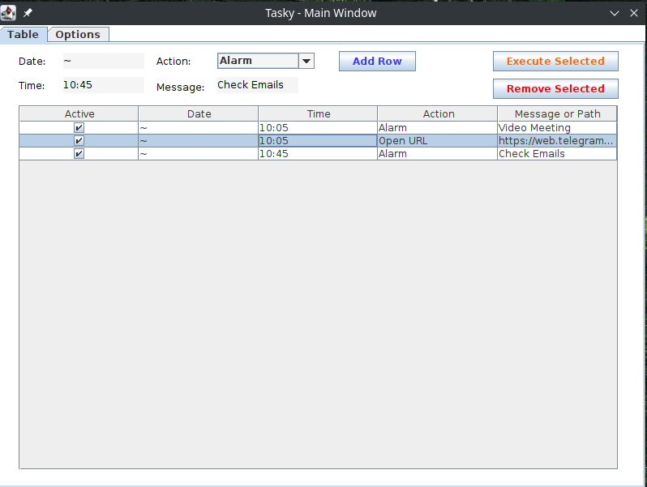
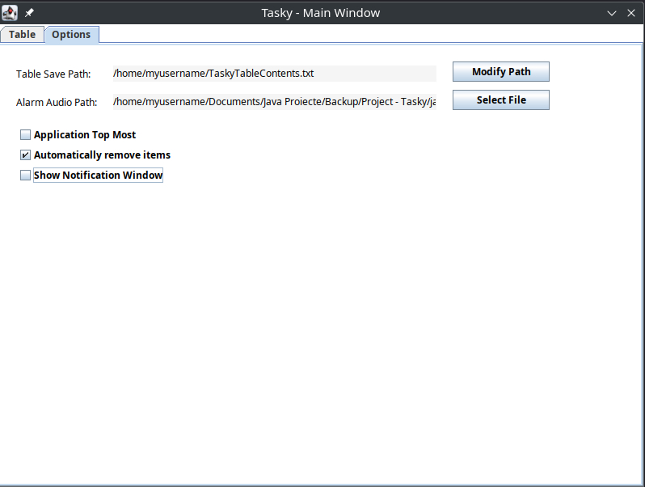

# Tasky

Dailly task scheduler

## Functions

### Main
- Alarm (notification (window + audio))
- Open any file (.txt, .mp4, .exe, script files, anything that your computer recognizes) on any OS (Linux, Windows, Mac)
- Open folder (open specific path)
- Open URL (make your default browser navigate to the specified URL)
- Shutdown PC

### Settings
- Keep application on top of all applications (including notification window)
- Automatically remove items when executed if they need to be executed only once
- Show notification window

